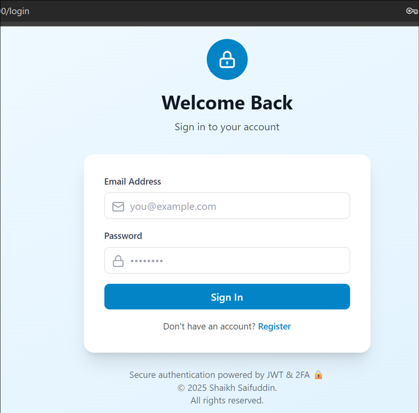
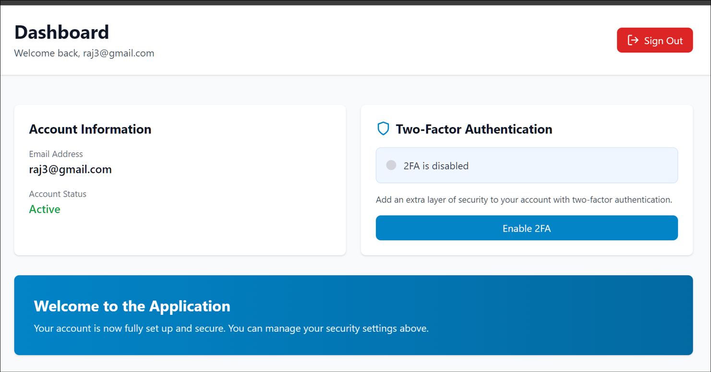

# Nest 2-factor-Auth Client

A modern React application with secure authentication and 2FA (Two-Factor Authentication) support for the NestJS API.

## Features

- 🔐 User Registration & Login
- 📱 Two-Factor Authentication (TOTP)
- 🎨 Beautiful and responsive UI
- 🛡️ JWT-based authentication
- 🚀 Built with React 18 & TypeScript
- 🎯 Tailwind CSS styling
- 🔄 Protected routes

### Step 1: Start


### Step 2: Enable


### Step 3: Scan


### Step 4: Verify

## Tech Stack

- **Frontend Framework**: React 18
- **Language**: TypeScript
- **Styling**: Tailwind CSS
- **HTTP Client**: Axios
- **Routing**: React Router v6
- **QR Code**: qrcode.react
- **Icons**: Lucide React

## Getting Started

### Prerequisites

- Node.js (v14 or higher)
- npm or yarn
- A running NestJS API backend

### Installation

1. **Navigate to the project directory**
   ```bash
   cd nest-client
   ```

2. **Install dependencies**
   ```bash
   npm install
   ```

3. **Create a `.env` file** in the root directory
   ```env
   REACT_APP_API_URL=http://localhost:3000
   ```

4. **Start the development server**
   ```bash
   npm start
   ```

   The app will open at `http://localhost:3000`

## Available Scripts

- `npm start` - Run development server
- `npm build` - Build for production
- `npm test` - Run tests
- `npm eject` - Eject from Create React App (irreversible)

## Project Structure

```
src/
├── api.ts                 # API client configuration
├── App.tsx               # Main app component
├── index.tsx             # Entry point
├── index.css             # Global styles
├── context/
│   └── AuthContext.tsx   # Authentication context
├── components/
│   ├── AuthLayout.tsx           # Auth page layout
│   ├── LoginForm.tsx            # Login form
│   ├── RegisterForm.tsx         # Registration form
│   ├── ProtectedRoute.tsx       # Route protection
│   ├── TOTPVerification.tsx     # 2FA verification
│   └── TOTPSetup.tsx           # 2FA setup
└── pages/
    ├── LoginPage.tsx           # Login page
    ├── RegisterPage.tsx        # Register page
    ├── DashboardPage.tsx       # Dashboard page
    └── VerifyTOTPPage.tsx      # 2FA verification page
```

## Usage Guide

### Registration
1. Click "Register" on the login page
2. Enter email and password
3. Account is created and you can login

### Login
1. Enter your email and password
2. If 2FA is enabled, you'll be prompted to enter a TOTP code
3. Access your dashboard upon successful authentication

### Enabling 2FA
1. Go to Dashboard → Two-Factor Authentication
2. Click "Enable 2FA"
3. Scan the QR code with an authenticator app (Google Authenticator, Authy, Microsoft Authenticator, etc.)
4. Enter the 6-digit code to verify setup
5. 2FA is now enabled for your account

### Disabling 2FA
1. Go to Dashboard → Two-Factor Authentication
2. Click "Disable 2FA"
3. Confirm the action

## Authentication Flow

### Standard Login
```
User Input → Password Verification → JWT Token → Dashboard Access
```

### Login with 2FA
```
User Input → Password Verification → Temporary Token (5 min) 
→ TOTP Verification Page → Full JWT Token → Dashboard Access
```

## API Integration

The app communicates with the following endpoints:

- `POST /auth/register` - Register new user
- `POST /auth/login` - Login user
- `POST /auth/totp/setup` - Setup 2FA
- `POST /auth/totp/verify-setup` - Verify 2FA setup
- `POST /auth/totp/verify-login` - Verify 2FA during login
- `GET /auth/totp/status` - Check 2FA status
- `POST /auth/totp/disable` - Disable 2FA

## Environment Variables

Create a `.env` file in the root directory:

```env
REACT_APP_API_URL=http://localhost:3000
```

## Building for Production

```bash
npm run build
```

This creates an optimized production build in the `build/` folder.

## Security Considerations

- All passwords are hashed before sending to the backend
- JWT tokens are stored securely in localStorage
- API calls include the JWT token in the Authorization header
- Protected routes require valid authentication
- TOTP codes are verified server-side

## Troubleshooting

### API Connection Issues
- Ensure the NestJS backend is running on `http://localhost:3000`
- Check the `REACT_APP_API_URL` environment variable
- Verify CORS is enabled on the backend

### TOTP Not Working
- Ensure your system clock is synchronized
- Try a different authenticator app
- Re-scan the QR code if setup wasn't completed

## Application UI

## License

MIT

## Support

For issues or questions, please refer to the main NestJS API documentation.
